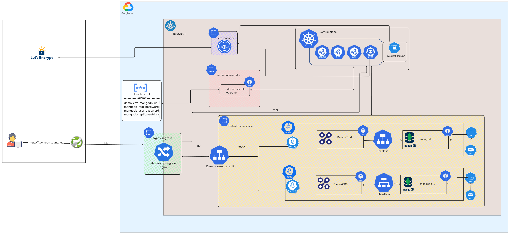

# Demo CRM v4 Helm Chart

This project packages the Demo CRM application as a production-ready Helm chart. It includes MongoDB, cert-manager, and the F5 NGINX Ingress Controller as dependencies, with externalized secrets via Google Secret Manager + External Secrets Operator (ESO).

## Prerequisites
- Kubernetes cluster (GKE recommended)
- kubectl and Helm v3
- DNS hostname pointing to the Ingress LoadBalancer IP
- Google Secret Manager secrets created
- External Secrets Operator installed (if using external secrets)

## Architecture Overview
The chart deploys:
- Demo CRM app (Deployment + Service + Ingress)
- MongoDB replicaset (StatefulSet + headless Service + PVCs)
- cert-manager for TLS certificates
- F5 NGINX Ingress Controller for traffic routing
- External Secrets Operator to sync secrets from Google Secret Manager

Overview:
- 

## Installation

### Quick Start
1) Update `demo-crm/values.yaml` with your domain and project settings.
2) Pull dependencies:
   ```bash
   helm dependency update demo-crm
   ```
3) Install:
   ```bash
   helm install demo-crm demo-crm
   ```

### Custom Install
```bash
helm install demo-crm demo-crm -f my-values.yaml
```

## Configuration Parameters
Key values in `demo-crm/values.yaml`:

| Key            |    Description    |        Example         |
| -------------- | ----------------- | -----------------------|
| `replicaCount` | Demo CRM replicas | `1` |
| `image.repository` | App image repo | `europe-north1-docker.pkg.dev/.../demo-crm` |
| `image.tag` | App image tag | `latest` |
| `service.type` | Service type | `ClusterIP` |
| `service.port` | Service port | `80` |
| `service.targetPort` | Container port | `3000` |
| `ingress.enabled` | Enable Ingress | `true` |
| `ingress.className` | Ingress class | `nginx` |
| `ingress.hosts` | Ingress host | `ademocrm.ddns.net` |
| `ingress.tls` | TLS secret + hosts | `demo-crm-tls` |
| `resources` | CPU/memory requests/limits | see values.yaml |
| `mongodb.enabled` | Install MongoDB | `true` |
| `mongodb.auth.existingSecret` | MongoDB creds secret | `mongodb-creds` |
| `externalSecrets.enabled` | Enable ESO resources | `true` |
| `externalSecrets.secretStore.projectId` | GSM project ID | `pure-hue-483512-h6` |
| `externalSecrets.secretStore.serviceAccountRef` | KSA for WI | `eso-gsm` |

## Testing
Use these checks after install:
```bash
kubectl get pods
kubectl get statefulset mongodb
kubectl get ingress
kubectl get externalsecret
curl -I https://ademocrm.ddns.net
```

## Troubleshooting
- **ExternalSecrets not Ready**: Verify Workload Identity is enabled and the KSA exists.
- **Ingress has no external IP**: Wait for LoadBalancer provisioning and recheck the Service.
- **TLS not Ready**: Check cert-manager logs and ClusterIssuer status.
- **MongoDB pods pending**: Verify PVC provisioning and storage class.

## Dependencies
Defined in `demo-crm/Chart.yaml`:
- `bitnami/mongodb`
- `jetstack/cert-manager`
- `nginx-ingress` (F5 NGINX)
